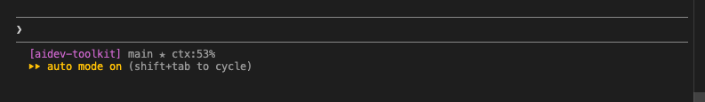

# Claude Code Status Line

The status line at the bottom of every Claude Code prompt shows your current git branch, working tree state, and — most importantly — **how full the context window is**. This document explains why that matters and how the implementation works.

---

## Why Context Window Visibility Matters

> **The problem:** Claude's performance degrades as the context window fills up — and without visibility into how full it is, you have no warning before it starts affecting quality.

Claude Code conversations have a finite context window. As it fills:

| Context Level | What Happens |
|---------------|-------------|
| 0–50%   | ✅ Full capability — reasoning, recall, and code quality are at their best |
| 50–75%  | ⚠️ Mild degradation — earlier conversation details start dropping off |
| 75–90%  | 🔶 Noticeable impact — responses may miss earlier context, instructions can be forgotten |
| 90–100% | 🔴 Severe degradation — compaction kicks in, significant context is lost, quality drops sharply |

Without a visible indicator, you only discover you're near the limit when things start going wrong — wrong assumptions, forgotten instructions, repeated mistakes. The `ctx:%` indicator gives you a heads-up so you can act before that happens (start a new conversation, use `/compact`, or wrap up the current task).

### What the Status Line Looks Like

```text
[aidev-toolkit] main ★ ctx:53%
```



The `ctx:%` value updates on every prompt, giving you a live reading throughout your session.

---

## Configuration Structure

Defined in `~/.claude/settings.json` under the top-level `statusLine` key:

```json
"statusLine": {
  "type": "command",
  "command": "<shell script>"
}
```

| Field     | Value       | Description |
|-----------|-------------|-------------|
| `type`    | `"command"` | Tells Claude Code to run a shell command for the status line |
| `command` | `"..."`     | Single-line bash; receives JSON on stdin, stdout becomes the status line |

Claude Code invokes the command on every prompt render, piping a JSON context object to stdin and displaying whatever the command prints to stdout.

### Full Command (copy-paste ready)

```json
"statusLine": {
  "type": "command",
  "command": "input=$(cat); cwd=$(echo \"$input\" | jq -r '.workspace.current_dir'); basename_cwd=$(basename \"$cwd\"); branch=$(cd \"$cwd\" && git rev-parse --abbrev-ref HEAD 2>/dev/null); status_symbols=''; ctx_pct=$(echo \"$input\" | jq -r '.context_window.used_percentage // empty'); ctx_str=''; [ -n \"$ctx_pct\" ] && ctx_str=$(printf \" ctx:%d%%\" \"$ctx_pct\"); if [ -n \"$branch\" ]; then cd \"$cwd\"; git_status=$(git -c core.useBuiltinFSMonitor=false status --porcelain 2>/dev/null); [ -n \"$(echo \"$git_status\" | grep '^A')\" ] && status_symbols=\"${status_symbols} ✈\"; [ -n \"$(echo \"$git_status\" | grep '^ M\\|^M')\" ] && status_symbols=\"${status_symbols} ✭\"; [ -n \"$(echo \"$git_status\" | grep '^ D\\|^D')\" ] && status_symbols=\"${status_symbols} ✗\"; [ -n \"$(echo \"$git_status\" | grep '^R')\" ] && status_symbols=\"${status_symbols} ➦\"; [ -n \"$(echo \"$git_status\" | grep '^U')\" ] && status_symbols=\"${status_symbols} ✂\"; [ -n \"$(echo \"$git_status\" | grep '^??')\" ] && status_symbols=\"${status_symbols} ✱\"; git_info=\"$branch$status_symbols\"; printf \"\\033[35m[%s]\\033[0m %s%s\" \"$basename_cwd\" \"$git_info\" \"$ctx_str\"; else printf \"\\033[35m[%s]\\033[0m%s\" \"$basename_cwd\" \"$ctx_str\"; fi"
}
```

---

## Input: Claude Code JSON Payload

The command receives a JSON object via stdin with at minimum these fields:

```json
{
  "workspace": {
    "current_dir": "/Users/bob/my-project"
  },
  "context_window": {
    "used_percentage": 40
  }
}
```

| JSON path | Type | Description |
|-----------|------|-------------|
| `.workspace.current_dir` | string | Absolute path of the current workspace |
| `.context_window.used_percentage` | number | Context window used, 0–100 |

---

## The Shell Command — Step by Step

### Step 1: Read and parse inputs

```bash
input=$(cat)
cwd=$(echo "$input" | jq -r '.workspace.current_dir')
basename_cwd=$(basename "$cwd")
branch=$(cd "$cwd" && git rev-parse --abbrev-ref HEAD 2>/dev/null)
status_symbols=''
```

- `cat` reads the full JSON payload from stdin
- `jq` extracts the working directory; `basename` trims it to just the folder name
- `git rev-parse --abbrev-ref HEAD` gets the current branch name; empty if not a git repo

### Step 2: Format context window percentage

```bash
ctx_pct=$(echo "$input" | jq -r '.context_window.used_percentage // empty')
ctx_str=''
[ -n "$ctx_pct" ] && ctx_str=$(printf " ctx:%d%%" "$ctx_pct")
```

- Reads the percentage from the JSON payload
- `// empty` returns an empty string (not `null`) when the field is absent
- Formats as `ctx:40%` when present; skipped entirely when absent

### Step 3: Collect git status symbols

```bash
git_status=$(git -c core.useBuiltinFSMonitor=false status --porcelain 2>/dev/null)
```

`--porcelain` produces machine-readable one-line-per-file output. Each file's state is checked with `grep` and mapped to a symbol appended to `status_symbols`:

| `git status --porcelain` pattern | Symbol | Meaning |
|----------------------------------|--------|---------|
| `^A` | ✈ | Staged / added |
| `^ M` or `^M` | ✭ | Modified |
| `^ D` or `^D` | ✗ | Deleted |
| `^R` | ➦ | Renamed |
| `^U` | ✂ | Unmerged / conflict |
| `^??` | ✱ | Untracked |

`-c core.useBuiltinFSMonitor=false` disables the FSMonitor daemon to avoid spawning background processes on every render.

### Step 4: Render output

**In a git repo:**

```bash
git_info="$branch$status_symbols"
printf "\033[35m[%s]\033[0m %s%s" "$basename_cwd" "$git_info" "$ctx_str"
```

**Not in a git repo:**

```bash
printf "\033[35m[%s]\033[0m%s" "$basename_cwd" "$ctx_str"
```

`\033[35m` is the ANSI escape code for **magenta**; `\033[0m` resets color.

---

## Example Outputs

```text
[aidev-toolkit] main ✭ ✱ ctx:40%
                      │  │
                      │  └─ untracked files present
                      └──── modified files present

[my-folder] ctx:12%          ← not a git repo

[aidev-toolkit] main ctx:5%  ← git repo, clean working tree
```

---

## Location

Defined in `~/.claude/settings.json` under the top-level `statusLine` key. This is a global setting — it applies to all Claude Code sessions regardless of project.

To install or update it, run the aidev-toolkit installer:

```bash
curl -fsSL https://raw.githubusercontent.com/jerichoBob/aidev-toolkit-dist/main/scripts/install.sh | bash
```
